# Spotify-Azure-Project
This  end-to-end Azure data engineering project designed by building a Spotify data pipeline. Uses medallion architecture where data moves from a cloud-hosted SQL database into bronze, silver, and gold layers within a Data Lake. The project emphasizes industry-standard practices, including CI/CD integration with GitHub, dynamic parameterized pipelines, and incremental data loading using Azure Data Factory. Advanced processing is handled through Azure Databricks, featuring Unity Catalog for governance and Delta Live Tables for managing slowly changing dimensions. Additionally, the project covers monitoring via Logic Apps and automated deployment using Databricks Asset Bundles

Resources was created like
-Resource group a high level container for all our reosurces
- Azure Data Factory    
- Azure Data Lake Storage Gen2     
- Azure SQL Database
- Azure Databricks  
- Azure Logic Apps
 
## Project Structure

A github account will be needed for the CICD and connected to Azure Data factory and a branch (branch_dev_tj) will be created which will be used to deploy pipelines created after chnages has been made for continous integrationa and delivery. All the code like the dataset, datafactory , linkedservice and pipelines will be deployed here and we also have the main branch (adf_publish)

- `Azure Data Factory`: Contains pipelines for data ingestion, transformation, and loading into the Data Lake.  With ADf we will be loading the data into the bronze layer from Azure SQL, aslo perform backfill and incremental load too.

Linked Service will be created, which are just connection credentials created to connect to both source (Azure server) and Sink (ADLSG2) and we will be using Autoresolve inetgration service which is the compute that will be used 
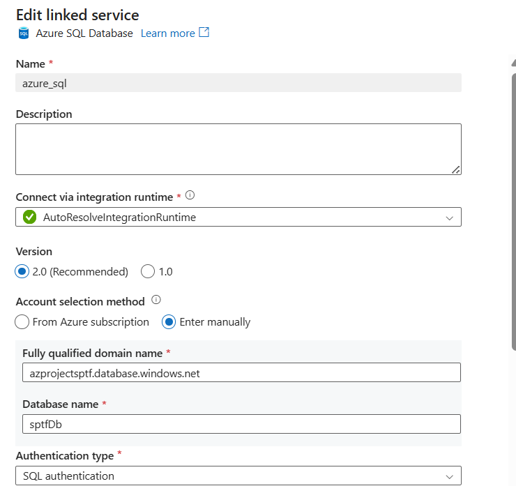
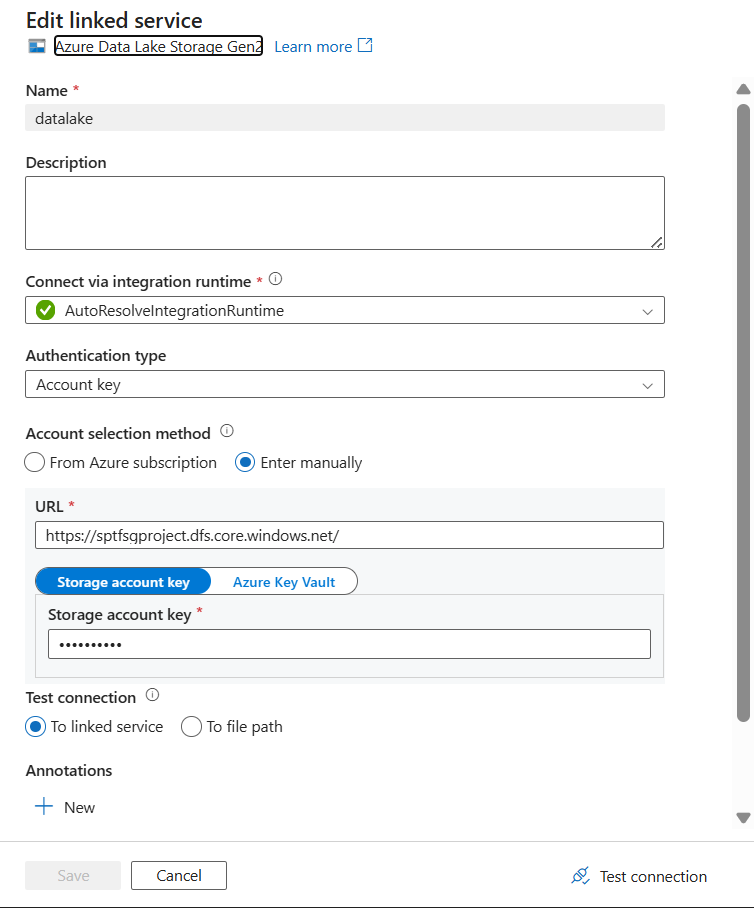
Account key will be used to authenitcate the connection between ADF and Azure SQL becuase we have both in the same resource group.

A parameterised Dataset will be created which tells us the structure, table and type of data we will be working with for both source and target. A parameterized dataset will be created  
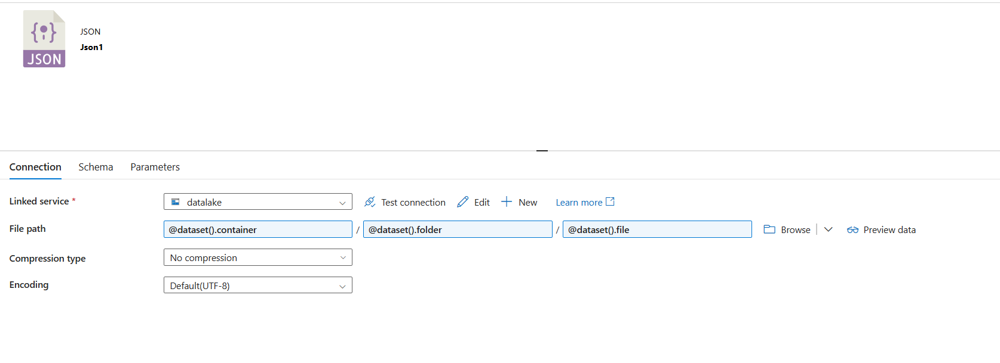

Lookup activity will be used to perform file fetching, fetch the content of any file and it can only return just 5000 rows at atime even if you have more than that in your data set. 
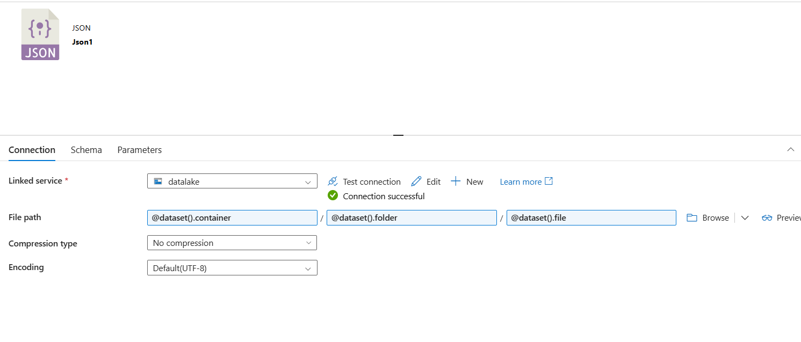

Withing the bronze DIrectroy a file will be uploaded empty.JSon, just an empty dictionary for now which will be used by the look up activity to know the last change data capture date.
 

A JSon (cdc_json)file will be created which will store the key for us to recored our initial load and incremental load e.g 1900/01/01.
Then to perfrom our incremenatal upload, the json  file will change again after the first load and will pick the new date that has not been load

When we need to load different files from that Azure SQL, we can always use this pipeline by chnaging the parameter name to any data we want to extract
This will be used in the expression builder to create our initial and incremental upload
using this code

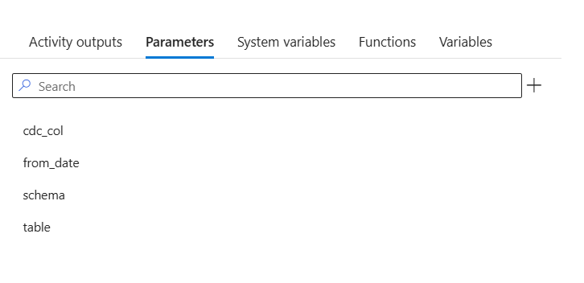

Select * from table 
where column> 1900/01/01

This will load our initail load and store the CDC column

when the pipeline run it will creat a file automatically and load the data into it as a parquet file
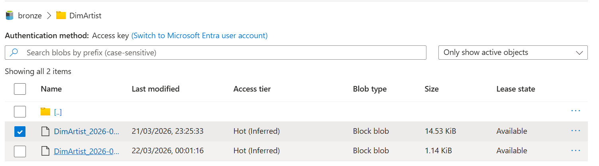

to update the last_cdc a copy activity will also be used also called watermarking technique to store our watermarks and update the last_cdc lookup activity

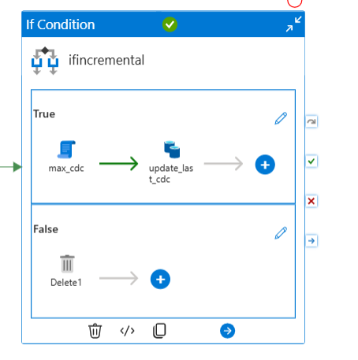

They are three activities in the if condition 

1. Max_cdc 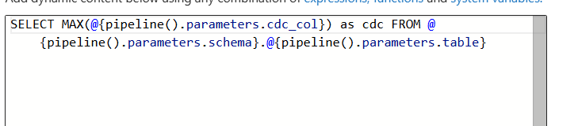 will get the maximum date from the Azure sql server, which is a script activity which is used to run sql command like DDL, DML.

2. the  the empty json will be used to update the cdc.json and the copy activity will be used to copy the max date and update the cdc.json and the lookup activity will be used to keep the record of the cdc column which is timestamp in the data, which is updated at in my various dimensions and fact table

The delete activity will be used to create extra files when no data are created when the max_cdc does not chnage and the copy aactivity will ceate a new file in the DimArtist_cdc folder but the if condtion will be used negate this, when the files does max cdc does not get a new date for example, the if condition delete the files immediately without letting us create unnecessary files in the bronze layer.

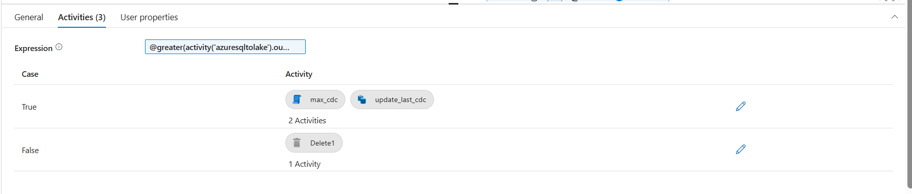
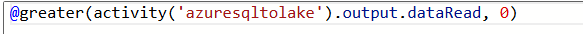

They are 5 tables in the Azure sql we need to create five folders will be created to store the cdc json files which is used by the look up atctivity initialy created and the empty.json whichis used to update the cdc.json cdc column 

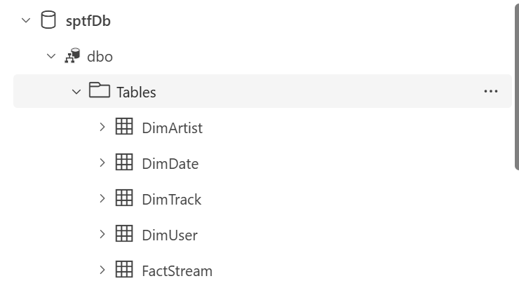.

to apply back filling to the pipeline, a new parameter will be added to the parameter called from_date 

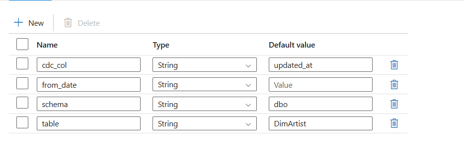
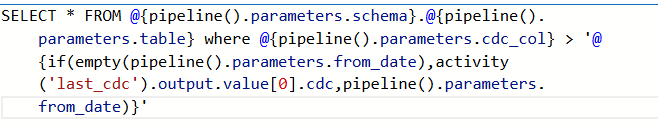

it works by checking if the from_date is emply it perform an initial or incremental uplaod but if not the backfilling will pcik the date passed to the from_date paramater

Copy activity in ADF will be used to migrate data from Azure SQL to ADLG2

For increemmental laoding a Query will be written to extract the data from Azure SQL to ADF
This pipeline is performing both initial and incremental loading. 
a json file will be created which will store our CDC, it will be backdated till about 1900-01-01
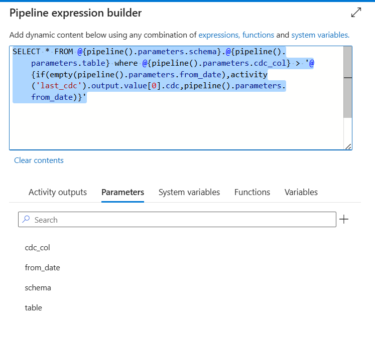

Process:

1️⃣ Loop through tables
2️⃣ Get the last CDC value
3️⃣ Query only new records
4️⃣ Load them to  datalake

Why this approach was used:
✔ avoids full loads
✔ processes only new data
✔ supports many tables with one pipeline
✔ reduces compute cost

Parameters will be created to be able to reuse the pipeline for all other dataset in Azure SQL
Schema: 
table
cdc column
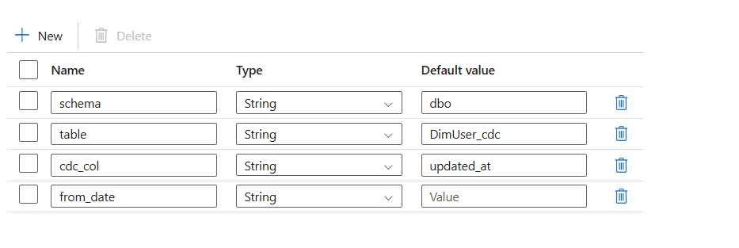

- `Azure Data Lake Storage Gen2`: Organized into bronze, silver, and gold layers for raw, cleansed, and curated data.
- `Azure SQL Database`: Hosts the source data for the Spotify dataset.
- `Azure Databricks`: Used for advanced data processing, including Unity Catalog for data governance and Delta Live Tables for managing slowly changing dimensions.
- `Azure Logic Apps`: Implements monitoring and alerting for pipeline failures and performance issues.
## Key Features
- **CI/CD Integration**: Automated deployment of Azure Data Factory pipelines and Databricks notebooks using GitHub Actions.
- **Dynamic Parameterized Pipelines**: Enables flexible data processing based on runtime parameters.
- **Incremental Data Loading**: Efficiently loads only new or changed data into the Data Lake.
- **Data Governance**: Utilizes Unity Catalog in Azure Databricks for managing data access and lineage.
- **Monitoring and Alerting**: Implements Logic Apps to monitor pipeline performance and send alerts on failures.
## Conclusion.
