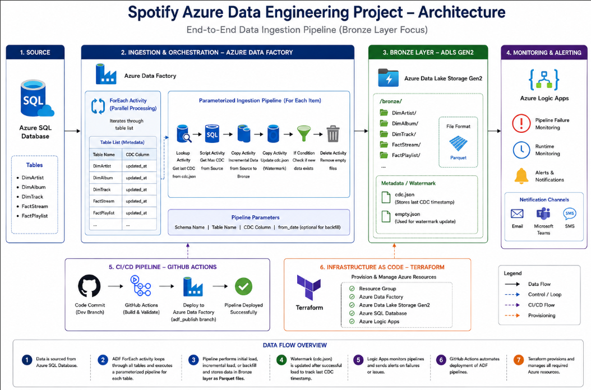
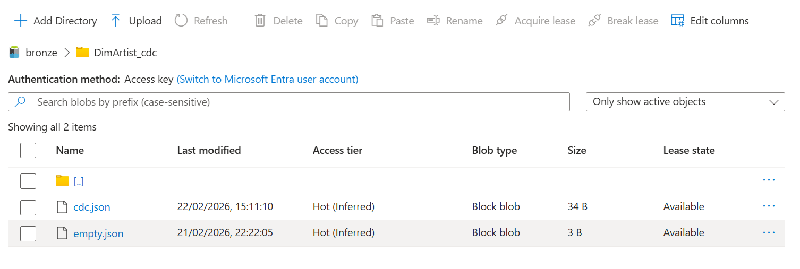
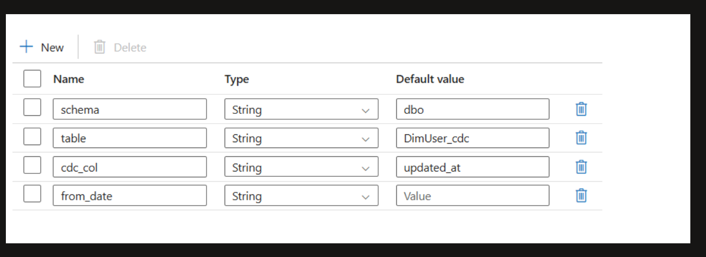
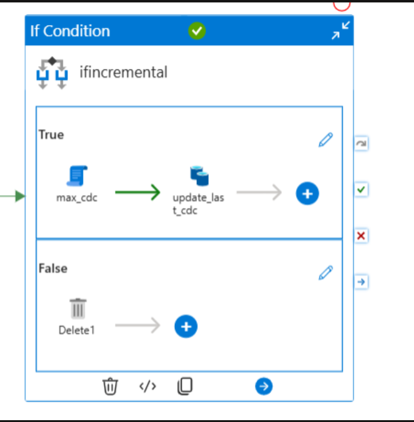
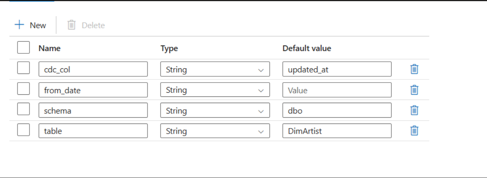
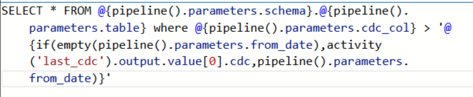

# Spotify Azure Data Engineering Project


End-to-end Azure Data Engineering project focused on building a scalable Spotify data ingestion pipeline using Azure services and a Bronze Layer architecture.

The project demonstrates industry-standard data engineering practices including:

* Incremental data loading
* Dynamic parameterized pipelines
* Watermarking for CDC processing
* Historical backfilling
* Parallel ingestion using ForEach activity
* CI/CD integration
* Monitoring & alerting
* Infrastructure as Code (IaC) using Terraform


---

# Architecture Overview


---

# Tech Stack

| Service                      | Purpose                        |
| ---------------------------- | ------------------------------ |
| Azure Data Factory           | Data ingestion & orchestration |
| Azure SQL Database           | Source system                  |
| Azure Data Lake Storage Gen2 | Bronze data lake storage       |
| Azure Logic Apps             | Monitoring & alerting          |
| GitHub Actions               | CI/CD automation               |
| Terraform                    | Infrastructure provisioning    |

---

# Project Architecture

## Data Flow

1. Data is sourced from Azure SQL Database
2. Azure Data Factory dynamically loops through tables using a **ForEach activity**
3. Pipelines perform:

   * Initial load
   * Incremental load
   * Historical backfill
4. Data is stored in the Bronze layer as Parquet files
5. Watermark (`cdc.json`) is updated after successful ingestion
6. Logic Apps monitor pipelines and trigger alerts
7. GitHub Actions automates deployment
8. Terraform provisions Azure resources














---

# Key Features

## Dynamic Parallel Ingestion using ForEach Activity

A **ForEach activity** was implemented in Azure Data Factory to dynamically ingest multiple tables using a single reusable pipeline.

### Tables Processed

* DimArtist
* DimAlbum
* DimTrack
* FactStream
* FactPlaylist

### Benefits

* Reduces pipeline duplication
* Supports scalable ingestion
* Simplifies maintenance
* Enables parallel processing

The pipeline loops through metadata/configuration and processes all tables automatically.

---

## Incremental Loading

Uses a watermarking technique with `cdc.json` to process only new or updated records.

### Process

1. Lookup activity reads the last CDC timestamp
2. Script activity retrieves the latest CDC value from Azure SQL
3. Copy activity extracts only new records
4. Data is loaded into the Bronze layer
5. Watermark file is updated

### Benefits

* Avoids full reloads
* Reduces compute cost
* Improves pipeline performance
* Supports scalable ingestion

---

## Dynamic Parameterized Pipelines

ADF pipelines are reusable across multiple tables using parameters such as:

* Schema name
* Table name
* CDC column
* `from_date` for backfill

This allows a single ingestion framework to support multiple datasets.

---

## Backfill Support

Historical data loads are supported using an optional `from_date` parameter.

### Logic

* If `from_date` is empty → Incremental load runs
* If `from_date` contains a value → Historical backfill runs

---

## CI/CD Integration

GitHub is integrated with Azure Data Factory for automated deployments.

### Workflow

* Development occurs in feature/dev branches
* GitHub Actions validates and deploys pipelines
* `adf_publish` branch stores deployment artifacts

### Benefits

* Version control
* Automated deployment
* Easier collaboration
* Consistent releases

---

## Monitoring & Alerting

Azure Logic Apps monitor:

* Pipeline failures
* Runtime issues
* Processing alerts

Notifications can be triggered through:

* Email
* Teams
* SMS

---

# Azure Resources

The following resources were provisioned using Terraform:

* Resource Group
* Azure Data Factory
* Azure Data Lake Storage Gen2
* Azure SQL Database
* Azure Logic Apps

---

# Bronze Layer Structure

```bash id="jlwm31"
/bronze/
│
├── DimArtist/
├── DimAlbum/
├── DimTrack/
├── FactStream/
└── FactPlaylist/
```

---

# Metadata Structure

```bash id="ysx0mx"
/metadata/
│
├── cdc.json
└── empty.json
```

### Purpose

| File       | Description                   |
| ---------- | ----------------------------- |
| cdc.json   | Stores latest CDC timestamp   |
| empty.json | Used during watermark updates |

---

# Azure Data Factory Pipeline Flow

The pipeline uses a metadata-driven ingestion process.

## Pipeline Activities

| Activity              | Purpose                          |
| --------------------- | -------------------------------- |
| ForEach Activity      | Loops through tables dynamically |
| Lookup Activity       | Reads CDC watermark              |
| Script Activity       | Gets max CDC value               |
| Copy Activity         | Loads incremental data           |
| If Condition Activity | Checks if new data exists        |
| Delete Activity       | Removes unnecessary empty files  |

---

# Example Incremental Query

```sql id="0kg9au"
SELECT *
FROM table_name
WHERE updated_at > last_cdc_timestamp
```

---

# Folder Structure


Spotify-Azure-Project/
│
├── adf/
│   ├── pipelines/
│   ├── datasets/
│   ├── linkedServices/
│   └── triggers/
│
├── terraform/
│
├── images/
│   └── architecture.png
│
└── README.md
```

---

# Getting Started

## Prerequisites

* Azure Subscription
* Azure Data Factory
* Azure SQL Database
* Azure Storage Account
* Terraform
* GitHub Account


# Setup Steps


## 1. Clone Repository

git clone https://github.com/your-username/Spotify-Azure-Project.git


## 2. Deploy Infrastructure

```bash id="fqfhv5"
terraform init
terraform apply
```

## 3. Configure Azure Data Factory

* Create linked services
* Configure datasets
* Publish pipelines

## 4. Configure GitHub Integration

* Connect ADF to GitHub
* Set up GitHub Actions

---

# Future Improvements

* Add Silver & Gold layers
* Introduce Azure Databricks transformations
* Add Delta Lake support
* Implement automated data quality checks
* Add Power BI dashboards

---

# Learning Outcomes

This project demonstrates:

* Azure Data Factory orchestration
* Metadata-driven ingestion
* Incremental ingestion design patterns
* Watermarking techniques
* Dynamic pipeline development
* Parallel processing with ForEach activity
* CI/CD integration
* Infrastructure automation with Terraform

---

# Conclusion

This project showcases a production-style Azure Data Engineering ingestion pipeline using Azure Data Factory and Azure Data Lake Storage Gen2. It focuses on scalable, reusable, and cost-efficient ingestion patterns commonly used in enterprise data platforms.
